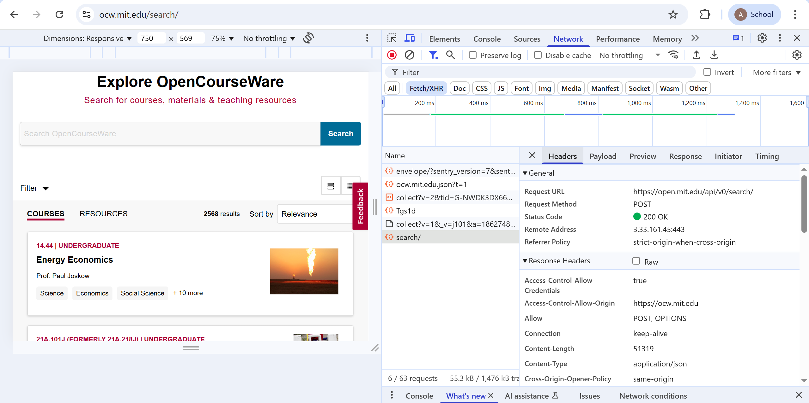
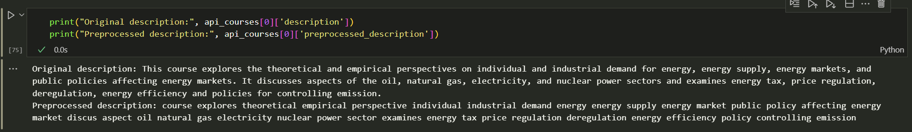
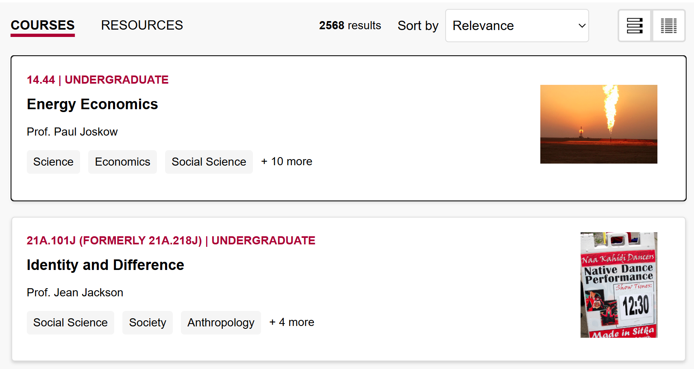
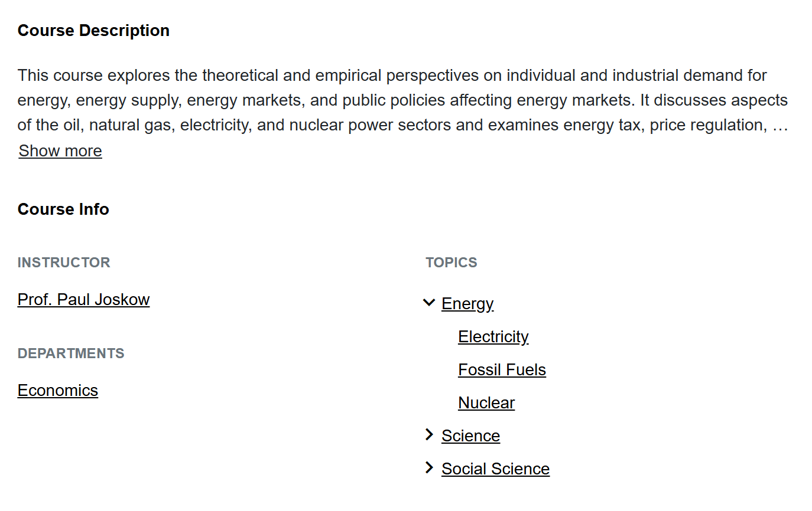

# sistech-take-home-1

## 📊 Data Source

Data course diambil dari website: [MIT OpenCourseWare Search](https://ocw.mit.edu/search/).  
Website ini merupakan situs open course dari MIT yang berisi kelas dari berbagai tingkatan studi.

Total course yang tersedia: **2,568**

### 📌 Fitur yang Diambil

| Fitur           | Penjelasan                                                                 |
|-----------------|------------------------------------------------------------------------------|
| `number`        | Kode kelas, sebagai unique identifier course                                |
| `title`         | Judul kelas                                                                 |
| `level`         | Tingkat studi (undergraduate/graduate/high school/non-credit). Bisa >1     |
| `year`          | Tahun kelas dijalankan                                                      |
| `semester`      | Semester (Fall/Spring/January IAP/Summer)                                   |
| `description`   | Deskripsi course (berguna untuk sistem rekomendasi)                         |
| `topics`        | Topik-topik terkait course (berguna untuk sistem rekomendasi). Bisa >1     |
| `instructors`   | Informasi profesor pengajar. Bisa lebih dari satu                           |
| `department_name` | Nama departemen / jurusan                                                 |

---

## 🛠 Scraping Tools and Flow

### 🔧 Tools
- **BeautifulSoup**
- **Selenium**
- **Requests**

### 🔁 Flow

#### 0. Identifikasi Website
Setelah inspeksi dengan BeautifulSoup, saya menemukan bahwa website bersifat **dinamis**, sehingga scraping lebih mudah dilakukan menggunakan **Selenium**.

Saya melakukan fetch data dengan dua cara:
- Scraping (`Selenium + BeautifulSoup`)
- API (`Requests`)

---

#### 🐍 Scraping (Selenium + BeautifulSoup)

1. **Inisialisasi driver & buka halaman utama**
   - `https://ocw.mit.edu/search/`

2. **Scroll website**
   - Karena web bersifat dynamically loaded, perlu scroll untuk load semua course.
   - Scroll dilakukan berulang dengan delay 6 detik agar web tidak overload.

3. **Ambil semua URL course**
   - Setelah scrolling selesai, ambil semua course URL.
   - Contoh: `https://ocw.mit.edu/courses/14-44-energy-economics-spring-2007/`

4. **Visit URL detail dan ambil informasi tambahan**
   - Beberapa info seperti `description` dan `department_name` hanya tersedia di halaman detail.
   - Loop semua URL dan scrape elemen tersebut.

---

#### ⚡ API (Requests) (Digunakan Untuk Store Final Data)

1. **Temukan endpoint API**
   - Inspect element > Network tab > temukan endpoint yang merespons data course.

2. **Copy body request**
   - Copy cURL → paste ke Postman untuk melihat struktur body dan headers.

3. **Ubah parameter**
   - Body memiliki parameter:
     - `"from"` = indeks course awal yang diambil
     - `"size"` = jumlah course per request (default: 10)
   - Saya ubah `size` menjadi `2568` dan `from` menjadi `0` agar langsung mendapat semua data dari awal.

---

## ✏️ Text Preprocessing

### 🔧 Tools
- `regex`
- `nltk`

Bahasa yang diproses adalah bahasa Inggris, jadi saya menggunakan tools yang sesuai.

### 🔄 Flow

1. Lowercase semua karakter
2. Hapus tanda baca dan simbol (hanya sisakan huruf & angka)
3. Remove stopwords (e.g., "the", "is", "and")
4. Lemmatization (lebih baik dari stemming karena mempertahankan makna/grammar)

### Field yang diproses:
- `title`
- `description`
- `topics`
- `department_name`

Field ini diproses karena akan digunakan dalam **sistem rekomendasi** (melalui text vectorization). Sedangkan fields lainnya seperti `level`, akan diproses dengan logic check biasa (cek apakah tingkat studi user sesuai), sehingga tidak perlu di-text processing.

### Hasil Sebelum dan Sesudah
Berikut adalah hasil sesudah preprocessing. Terlihat tanda baca hilang dan semua karakter huruf kecil, beberapa kata hilang karena termasuk stop word (it, dkk), dan ada beberapa kata yang direduce ke bentuk dasar, walaupun bentuk dasar tersebut bukan kata-kata Inggris (discusses > discus).

---

## Short Reflection

### Kendala 1: Website Dynamically Loaded
Saya baru sadar bahwa website hanya menampilkan 10 course awal. Setelah riset, ternyata web-nya **dynamically loaded**, sehingga saya pakai Selenium untuk scroll manual. Setelah mengaplikasikan cara tersebut, saya dapat mengambil semua 2,568 data course, namun tahapan ini memakan waktu lama (~26 menit).

---

### Kendala 2: Data tidak tersedia di main page

Informasi seperti `description` dan `department_name` **tidak tersedia** di halaman utama:

Untuk mengatasinya:
- Ambil semua course URL
- Kunjungi satu per satu
- Ambil data yang tidak ditampilkan di main page

Contoh halaman detail yang lebih lengkap:

---

### Tantangan Pribadi

Walau sudah bisa fetch lewat API, saya **tertantang untuk melakukan hal yang sama via scraping**.
Untuk mewujudkan ini, saya harus bisa:
1. Mengambil semua konten course > diatasi dengan scroll konten. Proses ini memakan waktu cukup lama, yaitu ~26 menit. 
2. Mengambil deskripsi course > diatasi dengan scraping di page detail, bukan main page. Proses ini juga memakan waktu lama sekali, (~200 menit). 

Tantangan terberat: **scrape halaman detail** — karena:
- Elemen kadang salah selector
- Atau belum muncul (belum loaded)

Saya mengatasinya dengan:
- Menggunakan `WebDriverWait` agar elemen benar-benar muncul dulu sebelum diambil.

---